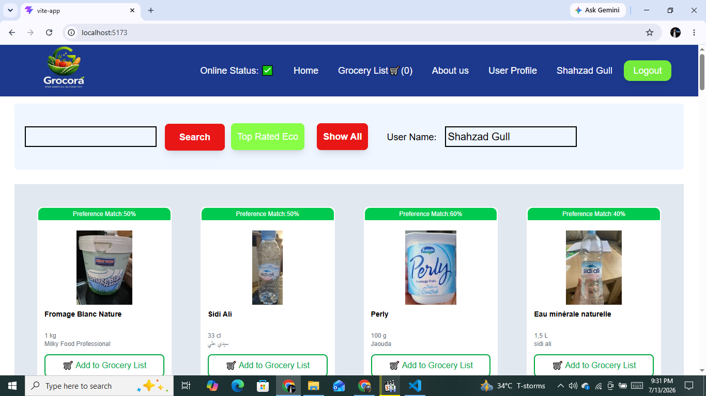
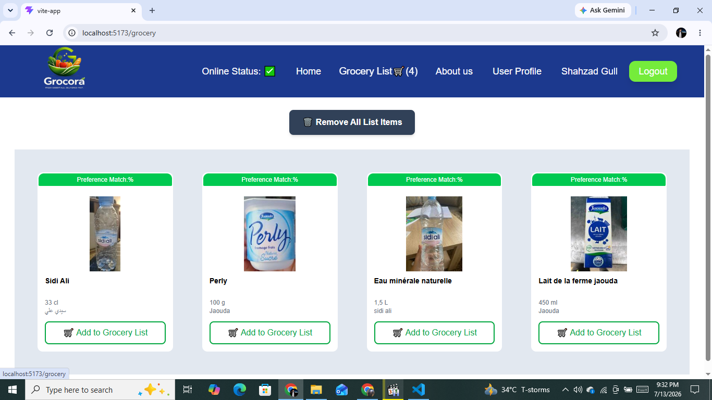
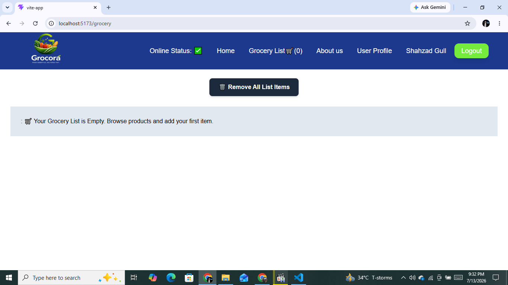

# 🥗 React Redux Healthy Grocery App

A modern React application that allows users to explore healthy food products, view detailed nutritional information, and manage a grocery list using **Redux Toolkit** and the **OpenFoodFacts API**.

---
## 🌐 Deployment

The application is deployed on Vercel:

**Live Demo:**  
https://react-redux-healthy-grocery-app-kvy.vercel.app

## 🚀 Features

- 🔍 Search food products
- 📦 View detailed product information
- 🥗 Health analysis for each product
- ⭐ Preference Match score using a Higher-Order Component (HOC)
- 🛒 Add products to Grocery List
- 🗑️ Clear entire Grocery List
- 📱 Responsive product grid
- 🌐 Online/Offline status detection
- ✨ Shimmer loading UI
- 🧩 Dynamic routing with React Router

---

## 🛠️ Tech Stack

- React.js
- Redux Toolkit
- React Redux
- React Router DOM
- Tailwind CSS
- OpenFoodFacts API
- Vite
- Custom Hooks
- Higher-Order Components (HOC)
- Context API

---

# 📚 React Concepts Practiced

### React Fundamentals

- Functional Components
- Props
- Conditional Rendering
- Lists & Keys
- Event Handling

### React Hooks

- useState
- useEffect
- useContext

### Custom Hooks

- API fetching
- Online status detection

### Routing

- Dynamic Routes
- Nested Routes
- React Router DOM

### Context API

- Global user information

### Higher Order Components

- Preference Match Badge

### Redux Toolkit

- configureStore()
- createSlice()
- Provider
- useSelector()
- useDispatch()
- Reducers
- Actions
- Global State Management

---

# 🛒 Redux Flow

```text
User Click
      ↓
dispatch(action)
      ↓
Reducer
      ↓
Redux Store
      ↓
useSelector()
      ↓
UI Re-renders
```

---

# 📂 Project Structure

```text
src
│
├── components
│   ├── Header
│   ├── Body
│   ├── Product
│   ├── ProductInfo
│   ├── GroceryList
│   └── HealthCard
│
├── utils
│   ├── store
│   │   ├── appStore
│   │   └── grocerySlice
│   ├── custom hooks
│   └── mappers
│
└── App.jsx
```

---

# 🎯 Redux Features Implemented

- Create Redux Store
- Create Slice
- Configure Store
- Wrap Application using Provider
- Dispatch Actions
- Subscribe using useSelector
- Add Grocery Item
- Display Grocery Items
- Clear Grocery List

---

# 🧠 Key Redux Learnings

### Store

A single global store manages the application's shared state.

---

### Slice

Each feature has its own slice containing:

- Initial State
- Reducers
- Actions

---

### Reducers

Reducers update the application state.

Redux Toolkit allows writing reducers using mutable syntax because it internally uses **Immer**.

---

### useSelector

Subscribe only to the required portion of the Redux store.

✅ Recommended

```js
const groceryItems = useSelector((store) => store.grocery.items);
```

❌ Avoid

```js
const store = useSelector((store) => store);
```

This causes unnecessary re-renders.

---

### useDispatch

Used to dispatch Redux actions.

```js
dispatch(addItems(product));
```

---

### Immer

Redux Toolkit internally uses **Immer**.

This allows writing:

```js
state.items.push(action.payload);
```

instead of manually creating new state objects.

---

# 📦 Installation

Clone the repository

```bash
git clone <repository-url>
```

Navigate to the project

```bash
cd react-redux-healthy-grocery-app
```

Install dependencies

```bash
npm install
```

Run the project

```bash
npm run dev
```

---

# 🌍 API

This project uses the **OpenFoodFacts API**.

It provides:

- Product Information
- Nutrition Data
- Eco Score
- Nutri Score
- Ingredients
- Brands
- Countries

---

# 📸 Application Preview

| Home Page | Grocery List |
|-----------|--------------|
|  |  |

### 🗑️ Empty Grocery List



# 📈 Future Improvements

- Remove Individual Item
- Quantity Management
- Favorites
- Authentication
- Persistent Grocery List
- RTK Query
- Unit Testing
- Dark Mode

---

# 👨‍💻 Author

**Shahzad Gull**

Learning modern React by building real-world applications with React, Redux Toolkit, and APIs.

GitHub: https://github.com/shahzadgull46